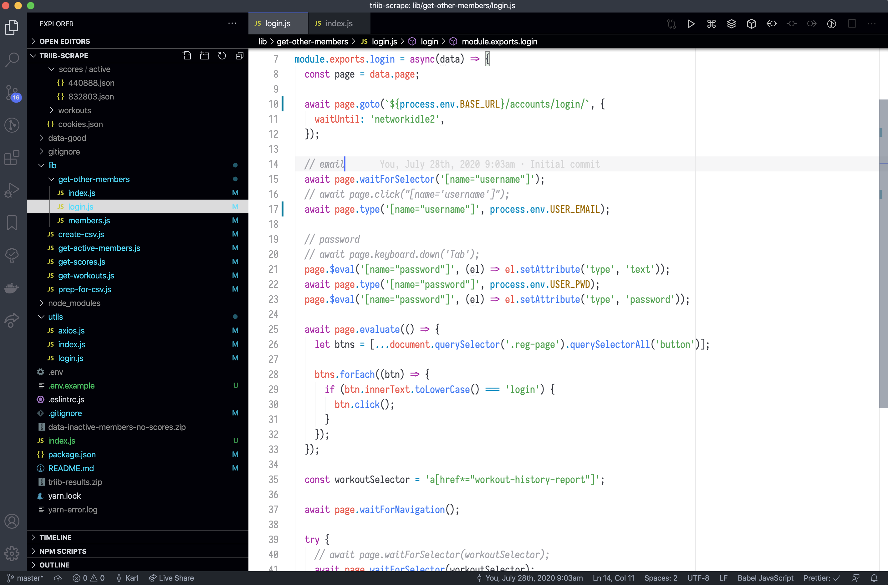

# README

This theme is an attempt to have dark UI features such as tabs, title bar, and file tree, while at the same time having a light-themed editor window.

## Current attempt

As of version 0.3.0, I'm marking it as a "dark" theme. This will make the text cursor color almost invisible. However, that can be fixed (on a Mac) from the package manager:

* `Cursor Color Fix: Enable`: enable the fix (adds custom CSS to override the `cursor` property)
* `Cursor Color Fix: Disable`: disable the fix (removes all the custom CSS)

**Note**: Because the custom CSS is injected directly in the `<head>` of Electron's workbench.html file, you'll probably see a warning:

> Your Code installation appears to be corrupt. Please reinstall.

You can click the gear icon in the warning popup and select "Don't Show Again."

You may also see "[unsupported]" appended to the file name in the title bar. To fix that, install the [Fix VSCode Checksums](https://marketplace.visualstudio.com/items?itemName=lehni.vscode-fix-checksums) extension and execute "Fix Checksums: Apply" from the command palette.

Many thanks to [Diego Curbelo](https://github.com/diegocurbelo) for his [Custom Pointer](https://github.com/diegocurbelo/vscode-custom-pointer) extension, which I modified to get the `Cursor Color Fix` feature working.

## Previously…

Previously I had been treating it as a "light" theme and overriding activityBar, sideBar, titleBar, tab, statusBar, etc. because I didn't know how to change the cursor color. the "dark" theme rendered the cursor color almost invisible

I had it the other way around, starting with a "dark" theme and overriding editor colors. The main problem with that, though, was the text cursor color, which was almost invisible and not configurable.

_There is no acounting for taste_, as they say.
